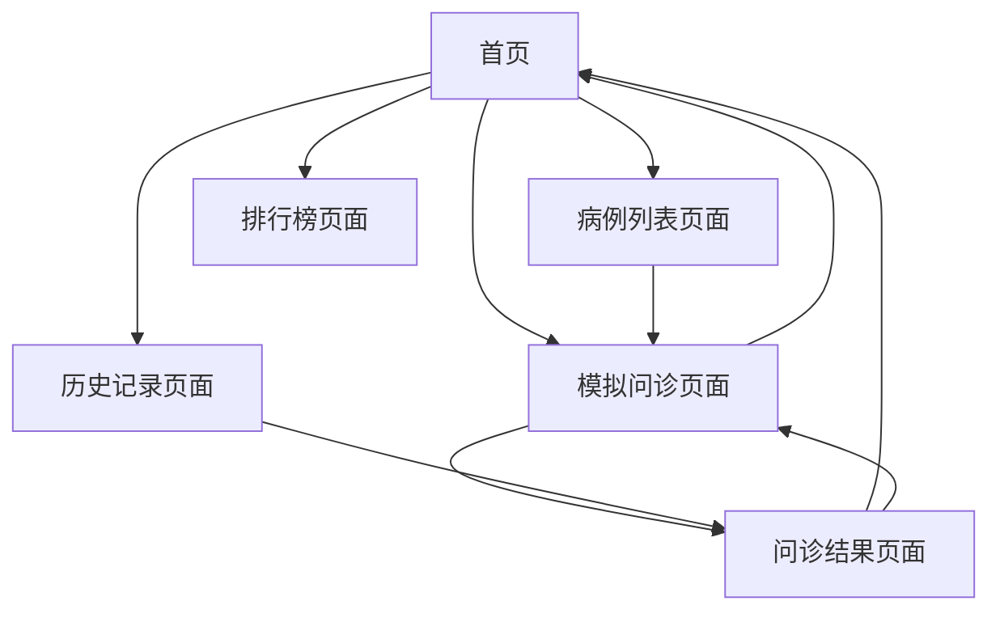

# 医疗问诊模拟系统产品需求文档

## 1. 产品概述

医疗问诊模拟系统是一个面向医学生和医务人员的在线学习平台，通过模拟真实的医患对话场景，帮助用户提升问诊技能和临床思维能力。系统提供多科室病例库，支持智能对话交互，并提供详细的评分反馈和学习建议。

- 主要解决医学教育中缺乏真实病例练习机会的问题，为医学生和年轻医生提供安全的学习环境
- 目标用户包括医学生、住院医师、主治医师等医务人员
- 通过标准化的病例模拟和智能评估，提升用户的临床问诊水平和诊断能力

## 2. 核心功能

### 2.1 用户角色

| 角色 | 注册方式 | 核心权限 |
|------|----------|----------|
| 普通用户 | 用户名登录（简化处理） | 可选择科室、进行病例练习、查看历史记录 |

### 2.2 功能模块

本系统包含以下主要页面：
1. **首页**：科室选择、病例推荐、用户状态展示、历史记录侧边栏
2. **模拟问诊页面**：分阶段问诊流程、智能提示、实时对话、等待状态显示
3. **问诊结果页面**：评分展示、详细复盘、改进建议、参考答案对比
4. **病例列表页面**：分科室病例浏览、病例详情预览
5. **历史记录页面**：完成病例查看、成绩统计、时间筛选
6. **排行榜页面**：用户排名、成绩对比

### 2.3 页面详情

| 页面名称 | 模块名称 | 功能描述 |
|----------|----------|----------|
| 首页 | 科室选择 | 支持心内科、外科、儿科、妇产科、急诊科等多科室选择，选择后显示对应病例 |
| 首页 | 病例推荐 | 展示当前科室的病例列表，包含病例名称、难度等级、简要描述 |
| 首页 | 用户状态 | 显示用户名、完成病例数、平均分数、总学习时长等统计信息 |
| 首页 | 历史记录侧边栏 | 快速查看已完成病例、支持时间筛选（7天/30天/全部）、清除历史功能 |
| 模拟问诊页面 | 分阶段问诊 | 包含信息采集、初步判断、辅助验证、治疗方案四个阶段，每阶段有明确指导 |
| 模拟问诊页面 | 智能提示 | 根据当前阶段提供相关问诊建议，支持一键发送，点击后显示等待状态 |
| 模拟问诊页面 | 实时对话 | 医生-患者对话界面，支持文本输入、语音输入（预留）、消息历史记录 |
| 模拟问诊页面 | 等待状态显示 | API请求时在footer上方显示浅灰色三点动画，回复后立即隐藏 |
| 模拟问诊页面 | 返回导航 | 统一样式的返回按钮，点击直接返回首页 |
| 问诊结果页面 | 评分展示 | 总分显示、各阶段得分详情、进度条可视化、等级评定 |
| 问诊结果页面 | 详细复盘 | 参考答案展示、用户答案分析、错误点与遗漏点说明 |
| 问诊结果页面 | 改进建议 | 针对性学习要点、下次练习建议、相关知识点推荐 |
| 病例列表页面 | 病例浏览 | 分科室展示所有可用病例，支持难度筛选、关键词搜索 |
| 历史记录页面 | 成绩统计 | 完成病例数、平均分、学习时长、进步趋势图表 |
| 历史记录页面 | 记录查看 | 历史病例列表、重新查看结果、删除记录功能 |

## 3. 核心流程

### 3.1 主要用户操作流程

**首次使用流程：**
1. 用户进入首页 → 选择科室 → 浏览病例列表 → 选择病例开始练习

**问诊练习流程：**
1. 进入模拟问诊页面 → 阅读患者主诉 → 开始信息采集阶段问诊 → 使用智能提示辅助 → 进入初步判断阶段 → 给出诊断假设 → 进入辅助验证阶段 → 开具检查项目 → 进入治疗方案阶段 → 制定治疗计划 → 完成诊断 → 查看结果页面

**历史回顾流程：**
1. 首页侧边栏 → 查看历史记录 → 选择时间范围 → 点击具体病例 → 重新查看结果详情

### 3.2 页面导航流程图

## 4. 用户界面设计

### 4.1 设计风格

- **主色调**：蓝色系（#3B82F6）作为主色，浅蓝色（#F0F2FF）作为背景色
- **辅助色**：灰色系用于文本和边框，绿色用于成功状态，红色用于错误提示
- **按钮样式**：圆角设计，支持hover效果，主要按钮使用渐变背景
- **字体**：系统默认字体，标题使用粗体，正文使用常规字重
- **布局风格**：卡片式布局，响应式设计，移动端优先
- **图标风格**：使用Lucide React图标库，线性风格，统一视觉语言

### 4.2 页面设计概览

| 页面名称 | 模块名称 | UI元素 |
|----------|----------|--------|
| 首页 | 顶部导航 | 汉堡菜单、科室选择按钮、用户头像，渐变背景色#E6E9FF到#F0F2FF |
| 首页 | 欢迎区域 | 医生插图、个性化问候语、统计数据展示，卡片阴影效果 |
| 首页 | 病例卡片 | 白色背景、圆角边框、序号标识、hover阴影效果 |
| 模拟问诊页面 | 对话界面 | 医生消息蓝色气泡右对齐、患者消息白色气泡左对齐、系统消息居中显示 |
| 模拟问诊页面 | 等待状态 | 三个灰色圆点动画，位于footer上方，半透明白色背景 |
| 模拟问诊页面 | 智能提示 | 白色卡片、蓝色按钮、自动隐藏机制、关闭按钮 |
| 模拟问诊页面 | 输入区域 | 圆角输入框、发送按钮、语音按钮、附件按钮 |
| 问诊结果页面 | 评分展示 | 大号分数显示、彩色进度条、等级徽章、时长统计 |
| 问诊结果页面 | 阶段详情 | 序号圆圈、分数对比、反馈文本、颜色编码（绿色优秀、蓝色良好、黄色一般、红色需改进） |

### 4.3 响应式设计

- **移动端优先**：基础设计面向手机屏幕，逐步适配更大屏幕
- **断点设置**：sm(640px)、lg(1024px)两个主要断点
- **触摸优化**：按钮最小44px点击区域，支持触摸手势
- **字体缩放**：移动端使用较小字号，桌面端适当放大
- **布局调整**：移动端单列布局，桌面端多列网格布局

## 5. 技术要求

### 5.1 性能要求

- 页面加载时间不超过3秒
- API响应时间不超过2秒
- 支持离线缓存基础功能
- 图片懒加载优化

### 5.2 兼容性要求

- 支持主流浏览器（Chrome、Firefox、Safari、Edge）
- 移动端适配iOS Safari和Android Chrome
- 响应式设计支持320px-1920px屏幕宽度

### 5.3 用户体验要求

- 等待状态必须有明确的视觉反馈
- 所有交互操作提供即时反馈
- 错误信息友好易懂
- 支持键盘导航和无障碍访问
- 返回按钮行为统一，均返回首页
- 界面元素样式保持一致性