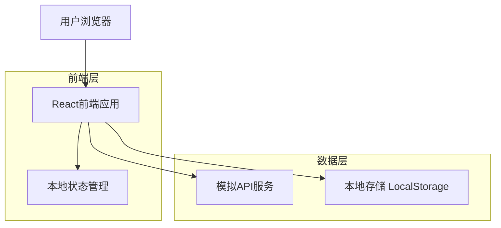
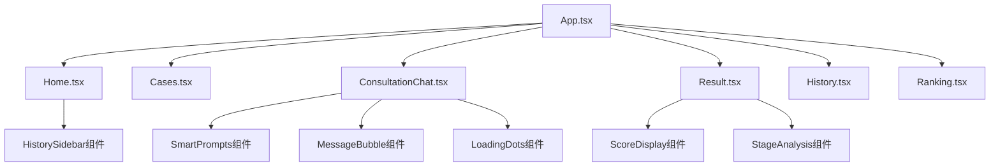
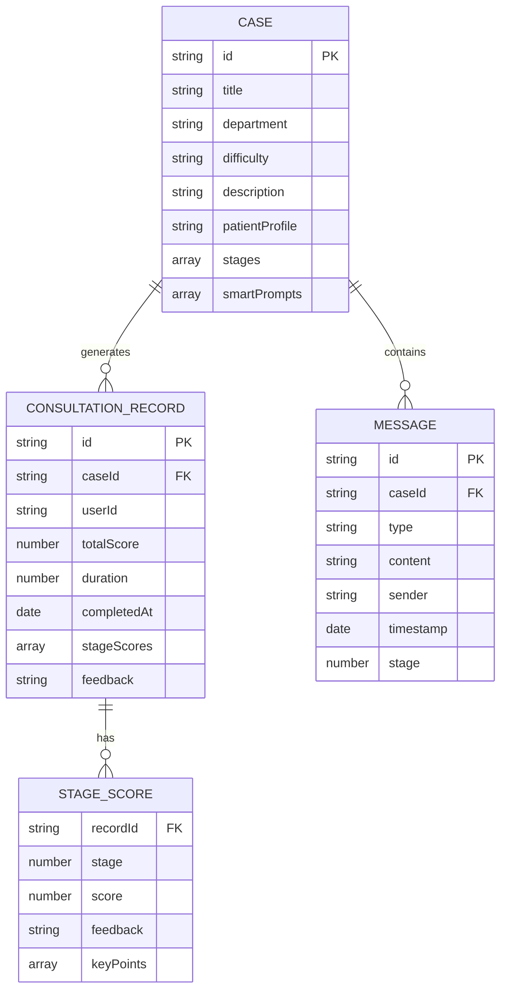

# 医疗问诊模拟系统技术架构文档

## 1. 架构设计



## 2. 技术描述

* **前端**: React\@18 + TypeScript + Tailwind CSS\@3 + Vite

* **状态管理**: React Hooks (useState, useEffect, useContext)

* **路由**: React Router DOM\@6

* **图标库**: Lucide React

* **构建工具**: Vite

* **样式框架**: Tailwind CSS

* **数据存储**: LocalStorage (用户历史记录)

## 3. 路由定义

| 路由                    | 用途                    |
| --------------------- | --------------------- |
| /                     | 首页，显示科室选择、病例列表、用户统计信息 |
| /cases                | 病例列表页面，按科室分类展示所有病例    |
| /consultation/:caseId | 模拟问诊页面，进行分阶段问诊练习      |
| /result               | 问诊结果页面，显示评分、复盘和建议     |
| /history              | 历史记录页面，查看已完成的病例练习     |
| /ranking              | 排行榜页面，显示用户成绩排名        |

## 4. 组件架构

### 4.1 核心组件结构



### 4.2 状态管理

**全局状态 (App.tsx)**

```typescript
interface AppState {
  selectedDepartment: string;
  currentCase: CaseData | null;
  consultationHistory: ConsultationRecord[];
  userStats: UserStats;
}
```

**页面级状态示例**

```typescript
// ConsultationChat.tsx
interface ChatState {
  messages: Message[];
  currentStage: number;
  isLoading: boolean;
  showSmartPrompts: boolean;
  stageScores: number[];
}

// Home.tsx
interface HomeState {
  cases: CaseData[];
  showHistory: boolean;
  historyFilter: 'all' | '7days' | '30days';
}
```

## 5. 数据模型

### 5.1 数据模型定义



### 5.2 数据定义语言

**病例数据结构 (cases.ts)**

```typescript
interface CaseData {
  id: string;
  title: string;
  department: string;
  difficulty: 'easy' | 'medium' | 'hard';
  description: string;
  patientProfile: {
    age: number;
    gender: string;
    chiefComplaint: string;
    presentIllness: string;
  };
  stages: StageConfig[];
  smartPrompts: SmartPrompt[];
  referenceAnswers: ReferenceAnswer[];
}

interface StageConfig {
  id: number;
  name: string;
  description: string;
  objectives: string[];
  timeLimit?: number;
  requiredQuestions: string[];
}

interface SmartPrompt {
  stage: number;
  category: string;
  suggestions: string[];
  priority: 'high' | 'medium' | 'low';
}
```

**问诊记录数据结构 (localStorage)**

```typescript
interface ConsultationRecord {
  id: string;
  caseId: string;
  caseTitle: string;
  department: string;
  totalScore: number;
  stageScores: StageScore[];
  duration: number; // 秒
  completedAt: string; // ISO date string
  messages: Message[];
  feedback: string;
}

interface StageScore {
  stage: number;
  score: number;
  maxScore: number;
  feedback: string;
  keyPoints: string[];
  improvements: string[];
}

interface Message {
  id: string;
  type: 'doctor' | 'patient' | 'system';
  content: string;
  timestamp: string;
  stage: number;
  isSmartPrompt?: boolean;
}
```

**用户统计数据结构**

```typescript
interface UserStats {
  totalCases: number;
  averageScore: number;
  totalStudyTime: number; // 分钟
  departmentStats: {
    [department: string]: {
      completed: number;
      averageScore: number;
    };
  };
  recentActivity: ConsultationRecord[];
}
```

## 6. 关键技术实现

### 6.1 等待状态管理

```typescript
// 等待状态显示逻辑
const [isWaiting, setIsWaiting] = useState(false);

const handleSendMessage = async (content: string) => {
  setIsWaiting(true);
  try {
    const response = await simulateAPICall(content);
    // 处理响应
  } finally {
    setIsWaiting(false);
  }
};

// LoadingDots组件
const LoadingDots = () => (
  <div className="flex justify-center items-center py-2">
    <div className="flex space-x-1">
      {[0, 1, 2].map((i) => (
        <div
          key={i}
          className="w-2 h-2 bg-gray-400 rounded-full animate-bounce"
          style={{ animationDelay: `${i * 0.1}s` }}
        />
      ))}
    </div>
  </div>
);
```

### 6.2 智能提示系统

```typescript
// 智能提示逻辑
const getSmartPrompts = (stage: number, messages: Message[]) => {
  const casePrompts = currentCase?.smartPrompts.filter(p => p.stage === stage) || [];
  const usedPrompts = messages
    .filter(m => m.isSmartPrompt)
    .map(m => m.content);
  
  return casePrompts.filter(prompt => 
    !usedPrompts.some(used => 
      prompt.suggestions.includes(used)
    )
  );
};
```

### 6.3 本地存储管理

```typescript
// 历史记录存储
const saveConsultationRecord = (record: ConsultationRecord) => {
  const existing = JSON.parse(localStorage.getItem('consultationHistory') || '[]');
  const updated = [record, ...existing].slice(0, 50); // 保留最近50条
  localStorage.setItem('consultationHistory', JSON.stringify(updated));
};

// 历史记录筛选
const filterHistoryByTime = (records: ConsultationRecord[], filter: string) => {
  const now = new Date();
  const cutoff = new Date();
  
  switch (filter) {
    case '7days':
      cutoff.setDate(now.getDate() - 7);
      break;
    case '30days':
      cutoff.setDate(now.getDate() - 30);
      break;
    default:
      return records;
  }
  
  return records.filter(record => 
    new Date(record.completedAt) >= cutoff
  );
};
```

### 6.4 评分算法

```typescript
// 阶段评分逻辑
const calculateStageScore = (
  stage: number, 
  messages: Message[], 
  referenceAnswers: ReferenceAnswer[]
): StageScore => {
  const stageMessages = messages.filter(m => m.stage === stage && m.type === 'doctor');
  const reference = referenceAnswers.find(r => r.stage === stage);
  
  if (!reference) return { stage, score: 0, maxScore: 100, feedback: '', keyPoints: [], improvements: [] };
  
  let score = 0;
  const keyPoints: string[] = [];
  const improvements: string[] = [];
  
  // 检查关键问题覆盖率
  const askedQuestions = stageMessages.map(m => m.content.toLowerCase());
  const requiredQuestions = reference.requiredQuestions;
  
  requiredQuestions.forEach(required => {
    const asked = askedQuestions.some(q => 
      q.includes(required.toLowerCase()) || 
      calculateSimilarity(q, required.toLowerCase()) > 0.7
    );
    
    if (asked) {
      score += reference.questionWeight;
      keyPoints.push(`正确询问了${required}`);
    } else {
      improvements.push(`应该询问${required}`);
    }
  });
  
  return {
    stage,
    score: Math.min(score, reference.maxScore),
    maxScore: reference.maxScore,
    feedback: generateFeedback(score, reference.maxScore),
    keyPoints,
    improvements
  };
};
```

## 7. 性能优化

### 7.1 代码分割

* 使用React.lazy()进行路由级代码分割

* 动态导入大型组件和工具库

### 7.2 状态优化

* 使用useMemo缓存计算结果

* 使用useCallback优化事件处理函数

* 避免不必要的组件重渲染

### 7.3 资源优化

* 图片懒加载

* 本地存储缓存策略

* 防抖处理用户输入

### 7.4 用户体验优化

* 骨架屏加载状态

* 错误边界处理

* 离线状态检测和提示

